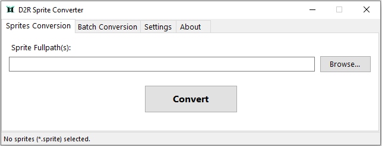
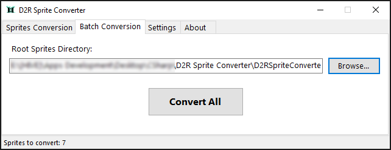
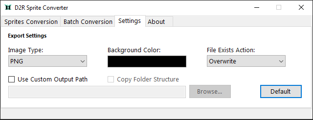

# Diablo II: Resurrected Sprite Converter

##### `Version:` 1.0.0.2

# 

### Converts Diablo 2: Resurrected Sprite (*.sprite) files to supported image types (PNG, JPG, GIF, or BMP).

* **Sprite Conversion**: Convert selected sprites (supports multiple selection).
* **Batch Conversion**: Convert sprites in the selected directory recursively.
* Settings:
  * Image Type: The format of the output image (determines the file extension as well).
  * Background Color: (For non-PNG image) Replaces transparency with a solid background color.
  * File Exists Action: Determines the action taken when the output filename already exists.
  * Use Custom Output Path: If enabled, converted images are saved to the specified custom path. Otherwise, images are saved relative to the converted .sprite file.
  * Copy Folder Structure: (Batch Conversion Only!) If enabled, re-creates the folder stucture relative to the converted sprites to the custom output path.
  
### Requirements

* Windows (7 or later)
* .NET Framework 4.7.2 or later

### Screenshots

### Remarks/Disclaimers

*D2R Sprite files are owned by Activision Blizzard, Inc., use this software at your own risk.*
