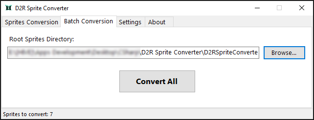
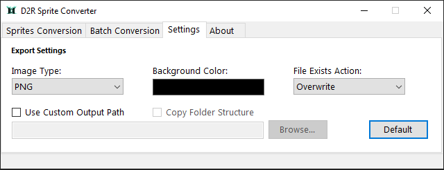

# Diablo II: Resurrected Sprite Converter

### Converts Diablo 2: Resurrected Sprite (*.sprite) files to supported image types (PNG, JPG, GIF, or BMP).

* Sprite Conversion - Convert selected sprites
* Batch Conversion - Convert sprites in directory recursively
* Settings - Configure export settings

